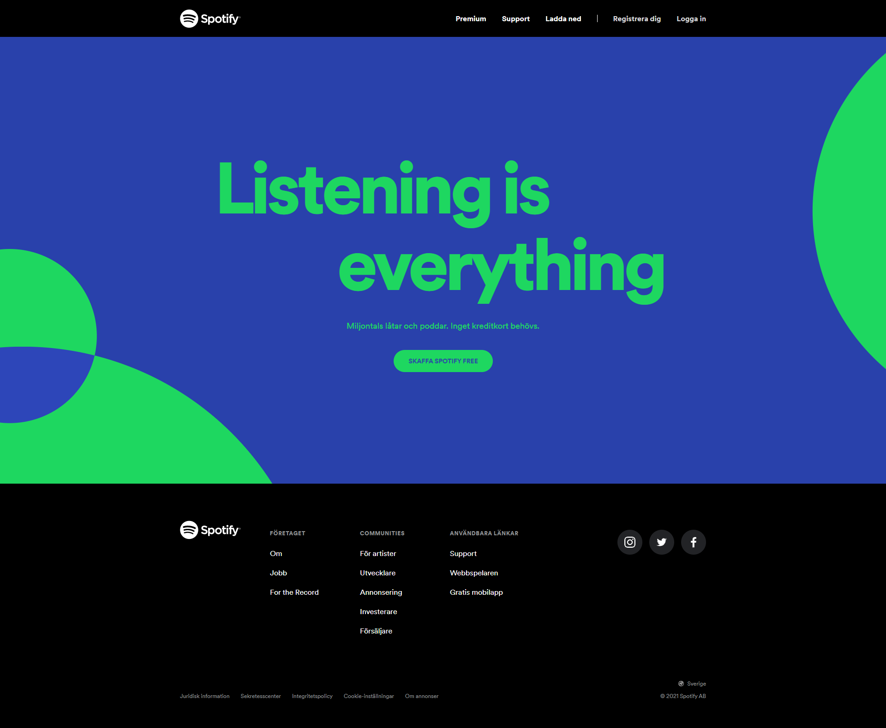
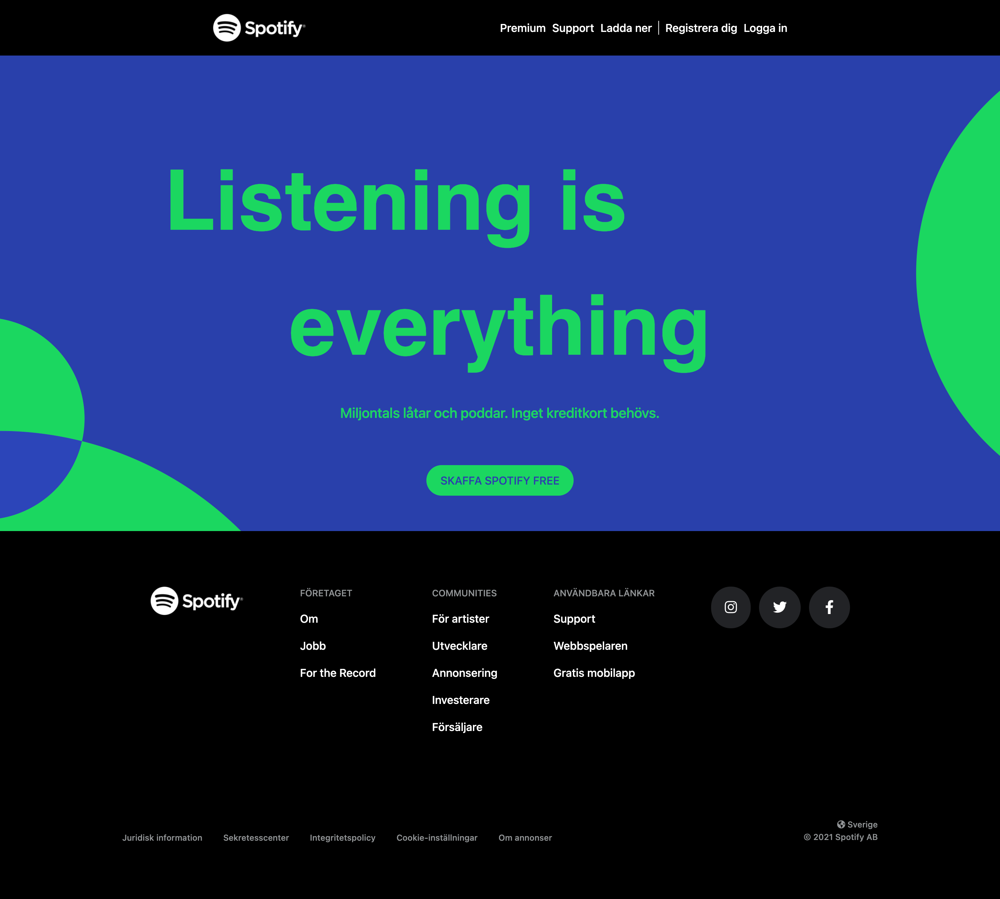

# Uppgift | Spotify

Vi har valt att återskapa **Spotifys** hemsida då det är en clean och snygg design, vi har inte behövt göra några större **avgränsningar** mer än att vissa iconer kanske inte är identiska i storlek. 

En av dem största utmaningarna var att få till **cirklarna** då vi försökt göra det från scratch, men tillslut så upptäckte vi att det gick att ladda ner **SVG:er** från deras hemsida så det var enklare att stylea. **Spotify** hade 3 olika **SVG:er**, en för desktop, en för mobile och en för pad-versionen. 

Vi har även valt att lägga till en button och göra dem interaktiva för extra detalj.

Länk till [Orginal Hemsidan](https://www.spotify.com/se/ ).

## Orginal Bild

## Vår Hemsida

## Developers 

`Felix`
`Emil`
`Erik`

